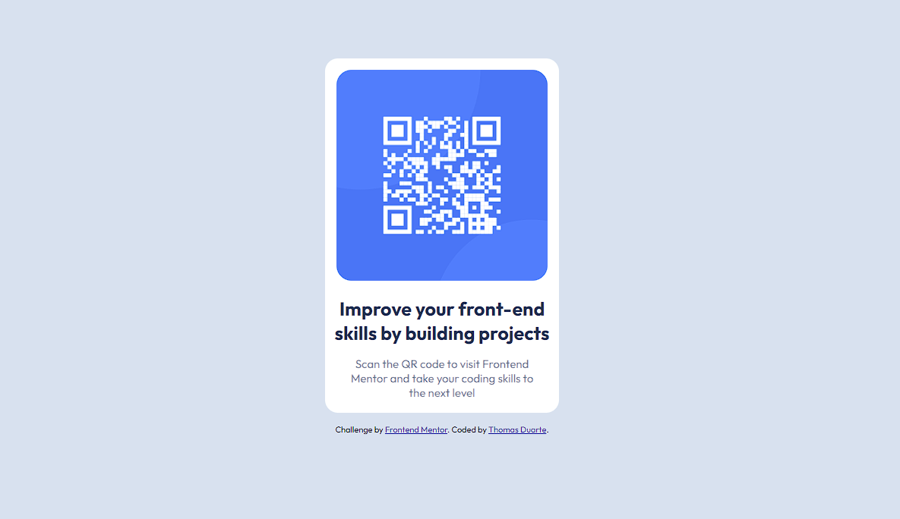

# Frontend Mentor - QR code component solution

This is a solution to the [QR code component challenge on Frontend Mentor](https://www.frontendmentor.io/challenges/qr-code-component-iux_sIO_H). Frontend Mentor challenges help you improve your coding skills by building realistic projects. 

## Table of contents

- [Overview](#overview)
  - [Screenshot](#screenshot)
  - [Links](#links)
  - [Built with](#built-with)
  - [What I learned](#what-i-learned)
- [Author](#author)
- [Acknowledgments](#acknowledgments)

## Overview

### Screenshot

### Links

- Solution URL: [Add solution URL here](https://github.com/tduarte23/QR-code-component)
- Live Site URL: [Add live site URL here](https://qr-code-component-sigma-five.vercel.app)

### Built with

- Semantic HTML5 markup
- CSS custom properties
- Flexbox
- CSS Grid
- Mobile-first workflow

### What I learned

Com esse desafio eu conseguir aplicar meus primeiros comnhecimentos e estudos em HTML e CSS fazendo meu primeiro "componente" estilo card.

### Continued development

Irei continuar tentando cada vez mais desafios acumulando mais conhecimento na area de front-end. Com estudos
em HTML, CSS, JS , React-Js e angular como foco.

## Author

- Website - [Add your name here](https://portfolio-liard-xi.vercel.app)
- Frontend Mentor - [@yourusername](https://www.frontendmentor.io/profile/tduarte23)

